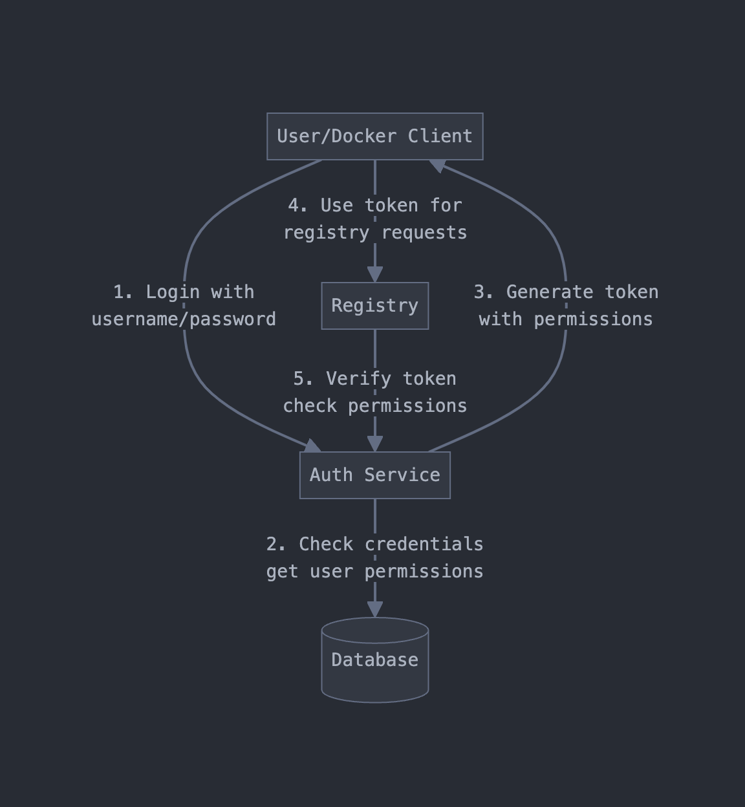

<div align="center">
  
  <p>A container registry built for developers. Convenient and without compromise.</p>
</div><hl>

# DistroFace Docs


## Features

- Built-in Authentication & Authorization
- Modern Web UI
- Image Migration Tool
- Role-Based Access Control
- Tag Management
- Registry Statistics

## API Endpoints

### Authentication

| Endpoint | Method | Description | Required Role |
|----------|---------|-------------|---------------|
| `/auth/token` | GET/POST | Get registry authentication token | None |
| `/api/v1/auth/login` | POST | Web UI login | None |
| `/api/v1/auth/refresh` | POST | Refresh authentication token | None |

### Registry Operations

| Endpoint | Method | Description | Required Role |
|----------|---------|-------------|---------------|
| `/v2/_catalog` | GET | List repositories | VIEW:IMAGE |
| `/v2/{name}/tags/list` | GET | List tags | VIEW:TAG |
| `/v2/{name}/manifests/{reference}` | GET | Get manifest | PULL:IMAGE |
| `/v2/{name}/manifests/{reference}` | PUT | Upload manifest | PUSH:IMAGE |
| `/v2/{name}/blobs/{digest}` | GET | Download blob | PULL:IMAGE |
| `/v2/{name}/blobs/uploads/` | POST | Start blob upload | PUSH:IMAGE |
| `/v2/{name}/blobs/uploads/{uuid}` | PATCH | Upload blob chunk | PUSH:IMAGE |
| `/v2/{name}/blobs/uploads/{uuid}` | PUT | Complete blob upload | PUSH:IMAGE |

### User Management

| Endpoint | Method | Description | Required Role |
|----------|---------|-------------|---------------|
| `/api/v1/users` | GET | List users | VIEW:USER |
| `/api/v1/users` | POST | Create user | CREATE:USER |
| `/api/v1/users/groups` | PUT | Update user groups | UPDATE:USER |

### Migration

| Endpoint | Method | Description | Required Role |
|----------|---------|-------------|---------------|
| `/api/v1/registry/migrate` | POST | Start migration | MIGRATE:TASK |
| `/api/v1/registry/migrate/status` | GET | Check migration status | MIGRATE:TASK |

## Authentication Model


<div align="center">
  
  <p>Distroface runs the webui user auth and permissions model through the same channels as the docker client.</p>
</div>

## Quick Start

```bash
# Run with Docker
docker run -p 8668:8668 \
  -v /path/to/data:/data \
  nickheyer/distroface:latest

# Default login
Username: admin
Password: admin
```

## Development

```bash
# Install dependencies
make deps

# Build + run in development mode
make dev

# Build for production
make build
```

## License

MIT License - see [LICENSE](LICENSE) for details
