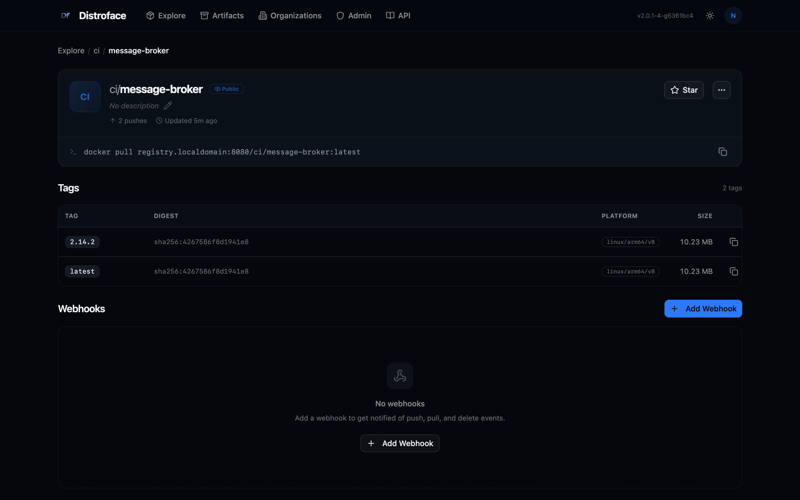
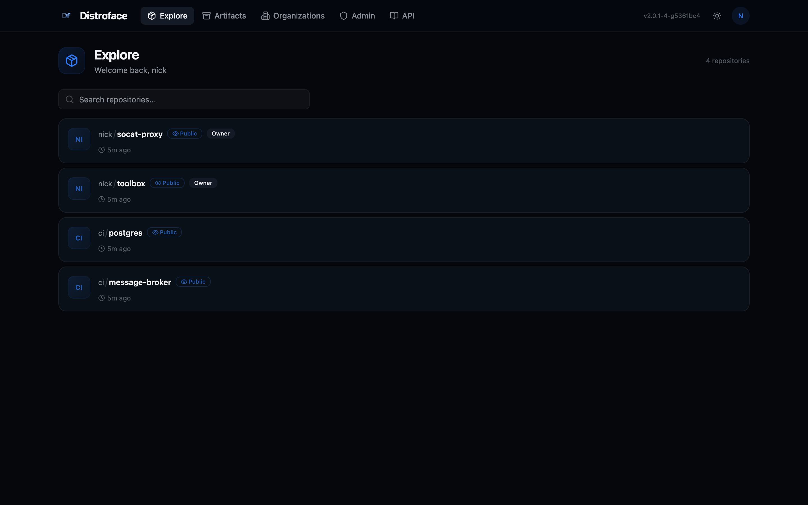
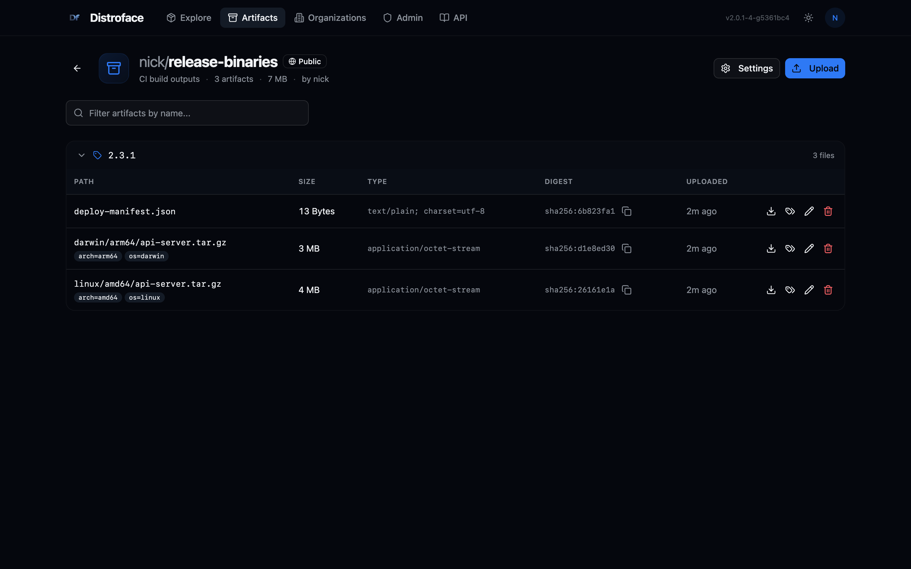
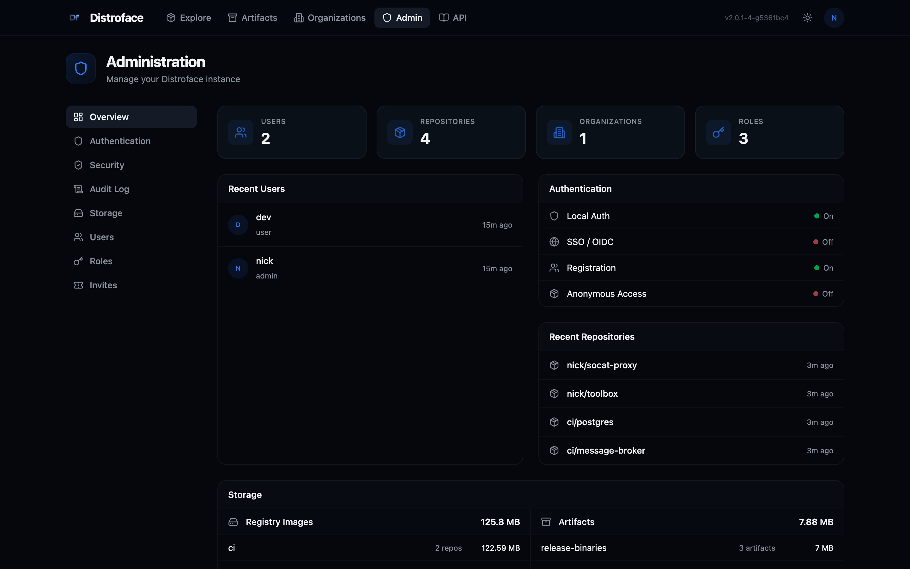
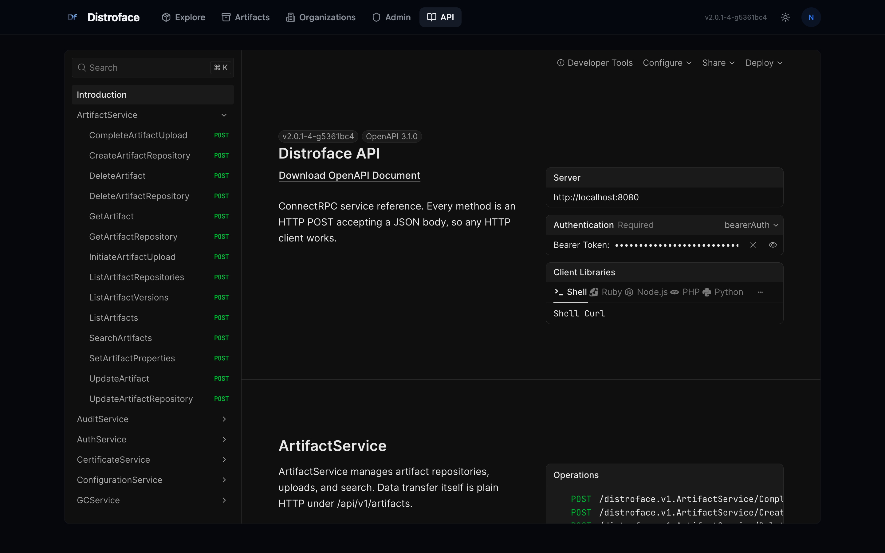

<div align="center">
  <p><b>DistroFace</b><br></p>
  <picture>
    <source media="(prefers-color-scheme: dark)" srcset="web/distroface/static/icon.png">
    
  </picture>
  <p><b>Blob Distribution & Storage</b><br></p>
</div>



## Run

```bash
docker run -p 8080:8080 -v distroface:/app/data nickheyer/distroface:latest
```

Open http://localhost:8080 and create an account, first one is admin.

```bash
docker login localhost:8080
docker tag alpine localhost:8080/myteam/alpine
docker push localhost:8080/myteam/alpine
```

## Inside

- OCI registry under `/v2/`, namespaced per user and org
- Artifact repos: versioned files, key=value properties, query-based download
- Org portals: A proxied interface for org resources, scoped to org members.
- Local accounts and OIDC (Keycloak / Authelia / Entra recipes in [`oidc/`](oidc))
- RBAC, personal access tokens, invites, audit log
- Webhooks on push, pull, and delete
- In-app TLS with ACME auto-cert issuance, per-hostname certs via SNI
- Registry GC and artifact retention reapers
- Rate limits and login lockout

|                                    |                                      |
| ---------------------------------- | ------------------------------------ |
|  |  |
|    |        |

## API

ConnectRPC — every method is a `POST` with a JSON body, so any HTTP client works. Interactive reference with OpenAPI download ships in the UI at `/docs/api`.

## CLI

Static `dfcli` binaries for linux/mac/windows on the [releases page](https://github.com/nickheyer/distroface/releases), or `make dfcli`.

```bash
dfcli login
dfcli artifact upload builds ./api-server.tar.gz -v 2.3.1 --property os=linux
dfcli artifact download builds -v 2.3.1 --property os=linux -o api-server.tar.gz
```

## Config

One `config.yaml` — every default is in [`config.example.yaml`](config.example.yaml). Any key works as a `DISTROFACE_*` env var. Seed users and orgs on first boot with the `bootstrap:` block.

## Hack

```bash
make deps   # go, npm, buf
make dev    # backend :8080 + vite frontend :5137
make build  # single binary, UI embedded
```

MIT — see [LICENSE](LICENSE).
